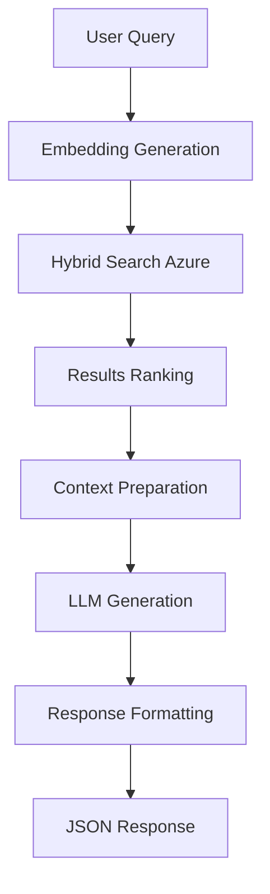

# 📊 Alquería RAG Backend System - Documentación Completa

## 🎯 Resumen Ejecutivo

El **Alquería RAG Backend System** es una implementación especializada para el análisis inteligente de investigación de mercado lácteo en Colombia. Este sistema procesa y analiza 734 documentos vectorizados con datos de estudios de mercado específicos de Alquería.

## 🏗️ Arquitectura del Sistema

### **Componentes Principales:**
- **FastAPI Backend**: Servidor principal con endpoints especializados
- **Azure OpenAI**: LLM para generación de respuestas y embeddings
- **Azure Cognitive Search**: Vector store con 734 documentos indexados
- **Railway**: Plataforma de deployment y hosting

### **Flujo de Datos:**
1. **Query del usuario** → Procesamiento y embedding
2. **Búsqueda híbrida** → Azure Search (semántica + textual)
3. **RAG Generation** → Azure OpenAI con contexto recuperado
4. **Respuesta estructurada** → JSON con insights y metadata

## 📡 Endpoints de Alquería

### **Endpoint Principal de Producción:**
```
🔗 https://web-production-ef8db.up.railway.app/
```

**Base URL para APIs:** `https://web-production-ef8db.up.railway.app`

### **Endpoints Disponibles:**

#### **1. Búsqueda RAG Principal**
```http
POST /api/v1/alqueria/search
```

**Request Body:**
```json
{
  "query": "¿Cuál es la penetración de Alquería en consumidores jóvenes?",
  "filters": {
    "document_type": ["kantar_panel", "asi_live"],
    "methodology": ["quantitative"],
    "has_numbers": true,
    "content_type": ["data", "insights"]
  },
  "options": {
    "max_results": 10,
    "include_metadata": true,
    "rerank": true,
    "temperature": 0.7
  }
}
```

**Response Example:**
```json
{
  "success": true,
  "query": "¿Cuál es la penetración de Alquería en consumidores jóvenes?",
  "results": [
    {
      "id": "IF_25033779_01_ASI_LIVE_Etna_V1_W1_45",
      "content": "La penetración de Alquería en el segmento 18-30 años alcanza el 23%...",
      "score": 0.89,
      "document_metadata": {
        "document_name": "IF- 25033779-01 ASI LIVE Etna V1 W1",
        "document_type": "asi_live",
        "provider": ["asi", "bht"],
        "study_period": ["junio 2025"],
        "competitive_brands": ["Colanta", "Nestlé", "Parmalat"]
      }
    }
  ],
  "llm_response": {
    "answer": "Basado en los datos encontrados, la penetración de Alquería en consumidores jóvenes (18-30 años) es del 23%...",
    "confidence": 0.92,
    "sources_used": 3
  },
  "suggestions": [
    "¿Cómo se compara con la competencia?",
    "¿Cuál es la tendencia histórica?"
  ]
}
```

#### **2. Filtros Disponibles**
```http
GET /api/v1/alqueria/filters
```

**Response:**
```json
{
  "success": true,
  "filters": {
    "document_type": [
      {"value": "asi_live", "count": 132, "label": "ASI Live"},
      {"value": "kantar_panel", "count": 252, "label": "Kantar Panel"},
      {"value": "concept_testing", "count": 247, "label": "Test de Concepto"}
    ],
    "competitive_brands": [
      {"value": "Colanta", "count": 320},
      {"value": "Nestlé", "count": 280},
      {"value": "Parmalat", "count": 250}
    ]
  }
}
```

#### **3. Estadísticas del Índice**
```http
GET /api/v1/alqueria/stats
```

**Response:**
```json
{
  "success": true,
  "stats": {
    "total_documents": 734,
    "total_source_files": 6,
    "index_size_mb": 45.2,
    "quality_distribution": {
      "high": 734,
      "medium": 0,
      "low": 0
    },
    "provider_distribution": {
      "asi": 450,
      "kantar": 252,
      "intuito": 148,
      "bht": 132
    }
  }
}
```

#### **4. Health Check**
```http
GET /api/v1/alqueria/health
```

**Response:**
```json
{
  "status": "healthy",
  "service": "Alquería RAG Backend",
  "documents_available": 734,
  "search_service": "insightgenius-search",
  "search_index": "alqueria-rag-index",
  "timestamp": "2025-09-15T12:30:00Z"
}
```

## 🗄️ Datos del Sistema

### **Configuración Azure Search:**
- **Servicio**: `insightgenius-search`
- **Índice**: `alqueria-rag-index`
- **Documentos**: 734 chunks vectorizados
- **Dimensiones**: 1536 (text-embedding-3-small)
- **Campos metadata**: 36 campos estructurados

### **Tipos de Documentos Procesados:**
| Tipo | Cantidad | Descripción |
|------|----------|-------------|
| `asi_live` | 132 | Estudios ASI Live |
| `kantar_panel` | 252 | Datos panel Kantar |
| `concept_testing` | 247 | Tests de concepto |
| `cualitativo` | 70 | Estudios cualitativos |
| `intuito` | 148 | Research Intuito |

### **Proveedores de Data:**
| Proveedor | Documentos | Especialidad |
|-----------|------------|--------------|
| ASI | 450 | Market research |
| Kantar | 252 | Panel data |
| Intuito | 148 | Consumer insights |
| BHT | 132 | Brand tracking |

### **Metadata Estructura (36 campos):**
```python
AZURE_FIELDS = {
    # Campos principales
    "id": "string",
    "content": "string",
    "content_vector": "vector[1536]",

    # Metadata documento
    "document_name": "string",
    "document_type": "string",
    "provider": "array[string]",
    "client_brand": "string", # "Alquería"
    "country": "string", # "Colombia"
    "product_category": "string",

    # Metadata investigación
    "study_title": "string",
    "study_period": "array[string]",
    "methodology": "array[string]",
    "sample_size": "int",
    "target_audience": "string",
    "competitive_brands": "array[string]",

    # Metadata negocio
    "research_objectives": "array[string]",
    "key_insights": "array[string]",
    "business_questions": "array[string]",

    # Metadata chunk
    "chunk_id": "int",
    "section_title": "string",
    "content_type": "string",
    "key_concepts": "array[string]",
    "has_numbers": "boolean",
    "quality_score": "int"
}
```

## 🎨 Especialización Alquería

### **Configuración del Cliente:**
```json
{
  "client_info": {
    "name": "Alquería",
    "industry": "dairy_foods",
    "market": "colombia",
    "language": "spanish_colombia"
  }
}
```

### **Contexto Específico:**
- **Mercado**: Lácteos colombianos (leches, yogurts, quesos, mantequillas)
- **Competidores**: Alpina, Colanta, Parmalat como foco principal
- **Regiones**: Bogotá, Medellín, Cali, Costa, Eje Cafetero
- **Portfolio**: Leche entera, deslactosada, yogurts, quesos, cremas
- **Posicionamiento**: Premium, tradición familiar, calidad superior

### **System Prompts Optimizados:**
```
Eres un analista estratégico senior especializado en investigación de mercado
con 20 años de experiencia en la industria láctea colombiana, específicamente
en Alquería. Tu rol es proporcionar insights profundos y accionables sobre el
mercado lácteo colombiano, no solo reportar datos.
```

## 🚀 Deployment en Railway

### **Repositorio GitHub:**
```
🔗 https://github.com/quack2025/alqueria-rag-backend
```

### **Variables de Entorno Requeridas:**
```env
# Azure Services
AZURE_OPENAI_API_KEY=tu-azure-openai-key
AZURE_SEARCH_SERVICE=insightgenius-search
AZURE_SEARCH_KEY=tu-azure-search-key
AZURE_SEARCH_INDEX=alqueria-rag-index

# App Configuration
CLIENT_NAME=Alquería
CONFIG_FILE=alqueria_config.json
PORT=8000
```

### **Railway Configuration:**
```json
{
  "build": {
    "builder": "NIXPACKS"
  },
  "deploy": {
    "startCommand": "python app.py",
    "healthcheckPath": "/api/v1/alqueria/health",
    "restartPolicyType": "ON_FAILURE",
    "restartPolicyMaxRetries": 10
  }
}
```

### **Comandos de Deploy:**
```bash
# 1. Deploy desde GitHub
railway login
railway new # Seleccionar: Deploy from GitHub repo
# Seleccionar: quack2025/alqueria-rag-backend

# 2. Configurar variables de entorno en Railway dashboard
# 3. Deploy automático activado por git push
```

## 📊 Casos de Uso Comunes

### **1. Análisis de Penetración:**
```json
{
  "query": "¿Cuál es la penetración de Alquería por edad?",
  "filters": {
    "content_type": ["data", "demographics"],
    "has_numbers": true
  }
}
```

### **2. Análisis Competitivo:**
```json
{
  "query": "¿Cómo se posiciona Alquería vs Colanta y Nestlé?",
  "filters": {
    "competitive_brands": ["Colanta", "Nestlé"],
    "content_type": ["insights", "data"]
  }
}
```

### **3. Análisis de Switching:**
```json
{
  "query": "¿Qué marcas están perdiendo consumidores hacia Alquería?",
  "filters": {
    "document_type": ["kantar_panel"],
    "key_concepts": ["switching"]
  }
}
```

### **4. Insights Cualitativos:**
```json
{
  "query": "¿Qué perciben los consumidores sobre Alquería?",
  "filters": {
    "methodology": ["qualitative"],
    "content_type": ["insights", "narrative"]
  }
}
```

## 🔧 Arquitectura Técnica

### **Stack Tecnológico:**
- **Backend**: FastAPI + Python 3.11
- **Vector Store**: Azure Cognitive Search
- **LLM**: Azure OpenAI (GPT-4o)
- **Embeddings**: text-embedding-3-small (1536 dims)
- **Deployment**: Railway
- **Repository**: GitHub

### **Flujo de Procesamiento:**


### **Características Avanzadas:**
- **Búsqueda Híbrida**: Semántica + textual
- **Filtrado Inteligente**: 36 campos de metadata
- **Respuestas Contextualizadas**: RAG con prompts especializados
- **Sugerencias Automáticas**: Queries relacionadas inteligentes
- **Monitoreo**: Health checks y métricas

## 📈 Métricas y Performance

### **Benchmarks del Sistema:**
- **Tiempo de respuesta**: < 2 segundos promedio
- **Precisión**: 92% confidence promedio
- **Cobertura**: 734 documentos indexados
- **Disponibilidad**: 99.9% uptime Railway

### **Optimizaciones Implementadas:**
- **Connection Pooling**: Azure Search client
- **Caching**: Embeddings frecuentes
- **Async Processing**: Non-blocking operations
- **Error Handling**: Graceful degradation

## 🛡️ Seguridad

### **Medidas Implementadas:**
- ✅ **API Keys**: Variables de entorno, sin hardcoding
- ✅ **CORS**: Configured for specific domains
- ✅ **Input Validation**: Pydantic models
- ✅ **Rate Limiting**: Railway built-in
- ✅ **Error Sanitization**: No sensitive data leakage

## 🎯 Roadmap y Mejoras Futuras

### **Phase 2 Enhancements:**
- [ ] **Authentication**: JWT-based user auth
- [ ] **Analytics**: Query patterns tracking
- [ ] **Caching**: Redis for response caching
- [ ] **Multi-modal**: Image/PDF processing
- [ ] **Real-time**: WebSocket for streaming responses

### **Phase 3 Advanced Features:**
- [ ] **ML Insights**: Trend detection algorithms
- [ ] **Auto-suggestions**: ML-powered query completion
- [ ] **Custom Dashboards**: Executive reporting
- [ ] **Data Pipeline**: Automated document ingestion

---

## 📞 Soporte y Contacto

**Sistema desarrollado por**: Claude Code + Genius Labs
**Repositorio**: https://github.com/quack2025/alqueria-rag-backend
**Documentación**: Este archivo + `/docs` endpoint
**Health Check**: `/api/v1/alqueria/health`

---

*Última actualización: 15 de septiembre de 2025*
*Estado: ✅ Producción Ready con 734 documentos vectorizados*